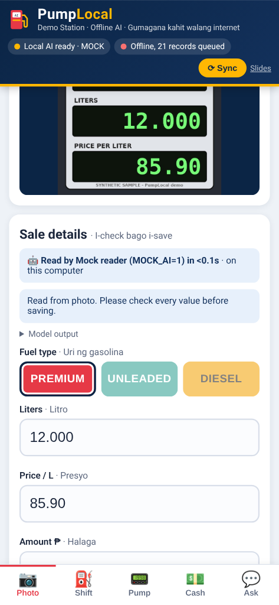
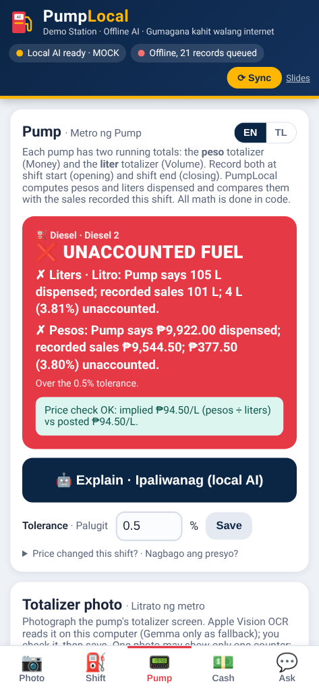
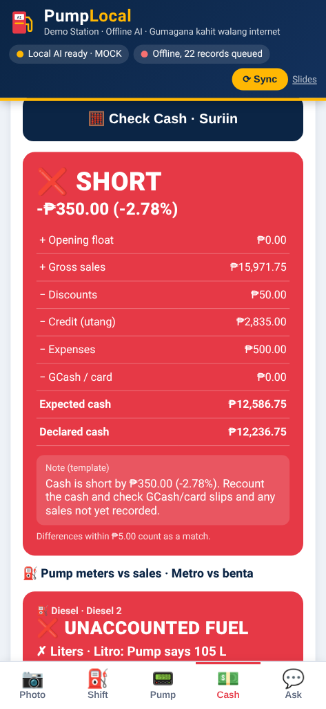
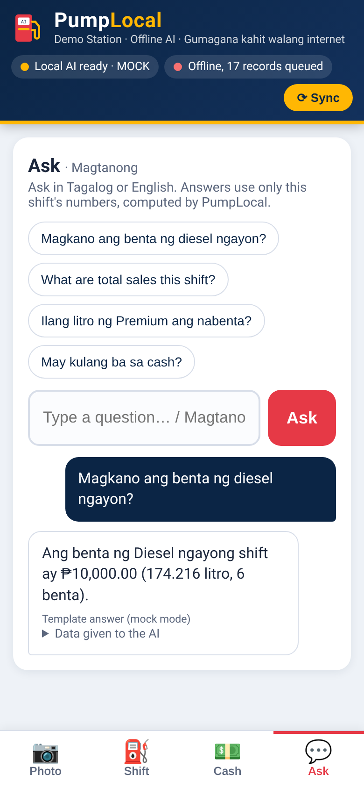

# ⛽ PumpLocal

**An offline AI assistant for small Filipino gas stations.** PumpLocal reads pump-meter and receipt photos, reads each pump's **totalizer** at shift start and end to catch fuel that left the pump without a recorded sale, flags cash mismatches at shift end, and answers staff questions in Tagalog or English. Everything runs on-device, so it keeps working through brownouts and dead internet.

**Local AI = two on-device models:**
- **Apple Vision OCR** (built into macOS) reads the digits on meter, receipt and totalizer photos. Plain code then turns the text into fields and checks the math. It is expected to take typically about a second per photo (not yet measured on the demo Mac).
- **Gemma 3 4B via Ollama** handles Tagalog/English Q&A and cash-check wording, and is the fallback photo reader when OCR can't produce numbers that add up. Records sync to the cloud once a connection comes back.

Built for **AppBuildersPH Hackathon 2026**, theme: **Local AI**.

| Shift Photo | Pump (totalizer) | Cash Check | Ask (Tagalog / English) |
|---|---|---|---|
|  |  |  |  |

<sub>These screenshots were taken in mock mode (`MOCK_AI=1`), so the AI answers shown are template text. The sample meter is a synthetic image. The Pump screenshot shows the seeded demo: the opening reading is from a real photo, the closing reading is demo data.</sub>

## Team

- **Johnny Bodegas**, solo

## What it does

1. **Shift Photo: Litrato ng metro o resibo.** Take or upload a photo of a pump meter or receipt. PumpLocal fills in `{fuel_type, liters, price_per_liter, amount_pesos}` in an editable form, and staff fix anything that's wrong before saving. The UI shows which local model read the photo and how many seconds it took.
   - **First: Apple Vision OCR** (`ocr/ocr.swift`, `VNRecognizeTextRequest`, accurate level, language correction off) returns text lines with positions. **Code, not AI** (`meterparse.py`) finds the fuel keyword (PREMIUM/UNLEADED/DIESEL) and links each number to the nearest label: AMOUNT/PESOS/TOTAL, LITERS/LITRO/VOLUME, PRICE/PER LITER. Numbers next to CASH, CHANGE, DATE or PUMP are ignored. It then checks that liters × price equals the amount within 1%. If only two of the three values are readable, the third is computed in code.
   - **Fallback: Gemma 3 4B** reads the photo only if OCR is unavailable, fails, or its numbers don't add up. The model's messy output (code fences, extra chatter, `₱1,000.00` strings) is parsed and checked the same way. If parsing fails, the fields stay blank and a note asks staff to type them in.
2. **Pump: Metro ng Pump (totalizer check).** A pump's totalizer is its lifetime counter. For each pump/nozzle (name such as "Diesel 2", fuel type), staff record an **OPENING** reading at shift start and a **CLOSING** reading at shift end, typed in or read from a photo with the same OCR-first pipeline (Apple Vision, then Gemma only as fallback).
   - **Code, not AI** (`totalizer.py`) picks the largest standalone number next to Volume/Vol/Total/Money/Amount/Liters, ignores menu numbers such as the "2." in "2.Money All", ignores dates and the number in a pump label, and detects the pump label (DIESEL 2, PREMIUM 1, UNLEADED) so the right pump is preselected.
   - Each pump has a **unit** (Liters or Pesos) and a **hidden-decimals** setting (0 by default; 2 or 3 means 775397 is 7,753.97 or 775.397). Some pump screens don't show the decimal point or the unit, so staff set this once per pump.
   - **Code computes** dispensed = closing − opening (closing lower than opening is flagged as an error: misread, wrong decimals or a rolled-over counter, never a negative sale). It then compares the pump total for each fuel with the liters (or pesos) of sales recorded this shift: *"Pump says 181 L dispensed; recorded sales 174.216 L; 6.784 L (3.75%) unaccounted"*. Over the tolerance (default 0.5%, editable in the tab) the card turns **red**. More recorded than dispensed is flagged too (a duplicate sale or a misread meter).
   - The local Gemma model only writes a short English or Tagalog explanation of those numbers, labeled as AI wording, with a template fallback. The gap also appears in the Cash Check summary and in the Ask data, so *"May kulang ba sa diesel?"* gets a straight answer.
   - At "Start new shift", each pump's closing reading carries over as the next shift's opening.
3. **Cash Check: Bilang ng pera.** At shift end, staff enter the declared cash, plus an optional opening float and GCash/card total. **Code, not the AI**, computes the expected cash from saved sales and flags SHORT or OVER with the peso amount and the percent. The AI only writes a 1–2 sentence explanation, which is labeled as AI wording. The pump-vs-sales gap for each fuel is shown in the same summary.
4. **Ask: Magtanong.** Staff type questions like *"Magkano ang benta ng diesel ngayon?"* or *"May kulang ba sa diesel?"* Code computes the shift totals and gives them to the model as its only data. The model answers in the same language. If the answer contains a number that isn't in the computed data, PumpLocal shows a warning.
5. **Offline sync queue.** Every record is saved locally in SQLite with `synced=0`. A Sync button (plus a background check every 30 s) POSTs unsynced records to `SYNC_URL`. When that fails or `SYNC_URL` isn't set, the header shows **"Offline, N records queued"**. Nothing else depends on the internet.
6. **Demo data.** On first run the app seeds a realistic shift: 15 sales across Premium (₱64.99/L), Unleaded and Diesel, plus a **Diesel 2** pump (liters, 0 decimals) with an opening totalizer of **775397** (the number on the real photo) and a closing of **775578**. **The closing reading is demo data**, chosen so the pump says 181 L while the seeded diesel sales add up to 174.216 L, so the Pump tab shows a 6.784 L (3.75%) gap right away. [`/samples`](samples/) has three **synthetic** images and one **REAL photo** of a totalizer screen from the team's own station (`real_totalizer_diesel2.png`).

All arithmetic is done in Python with `Decimal`, never by the model. That covers `liters = pesos ÷ price`, totals, expected cash, the difference and percent, and pump dispensed / gap / tolerance.

## How to run (macOS / Linux)

Requirements: Python 3 (the macOS system `python3` is fine) and [Ollama](https://ollama.com) with the model pulled:

```bash
ollama pull gemma3:4b        # one time, while online
xcode-select --install       # macOS, one time: Swift compiler for the Apple Vision OCR helper
```

On the first run on a Mac, the app compiles the OCR helper in the background (`swiftc -O ocr/ocr.swift -o ocr/pumplocal-ocr`) and caches the binary. It's rebuilt only if `ocr.swift` changes. If the Xcode command-line tools aren't installed, or on Linux, OCR is skipped and photos are read by Gemma.

Then run:

```bash
git clone https://github.com/bodegasjohnny-sketch/pumplocal && cd pumplocal && python3 app.py
```

This opens **http://localhost:8080**. You don't need `pip install`, because the app uses only the Python standard library. The database (`pumplocal.db`) is created and seeded automatically on first run.

For the demo, try the sample thumbnails on the Photo tab, check the Shift tab, open the **Pump** tab (tap the REAL totalizer photo), run a Cash Check, then ask *"May kulang ba sa diesel?"*.

A database created before the Pump feature gets the Diesel 2 demo pump automatically, as long as its open shift is still the seeded demo shift. Otherwise run `python3 seed.py --reset` (this wipes local data).

### Configuration (environment variables)

| Variable | Default | Purpose |
|---|---|---|
| `OLLAMA_URL` | `http://localhost:11434` | Local Ollama server |
| `MODEL` | `gemma3:4b` | Ollama model (must accept images for the Gemma photo fallback) |
| `READER` | `auto` | Photo reader. `auto` = Apple Vision OCR first, Gemma fallback. `vision` = OCR only. `gemma` = Gemma only |
| `OCR_TIMEOUT` | `30` | Seconds before an OCR run is abandoned |
| `STATUS_TIMEOUT` | `1.5` | Seconds for the header's Ollama check. A timeout while the model is working shows "Local AI busy" |
| `SYNC_URL` | *(unset)* | Cloud endpoint that receives queued records as a JSON POST. Unset means offline queue only |
| `PORT` / `HOST` | `8080` / `127.0.0.1` | Use `HOST=0.0.0.0` to open the app from a phone on the same Wi-Fi/LAN |
| `CASH_TOLERANCE` | `5.00` | Differences within this many pesos count as a match |
| `PUMP_TOLERANCE_PCT` | `0.5` | Default pump-vs-sales tolerance in percent (can be changed in the Pump tab) |
| `MOCK_AI` | `0` | `1` = no Ollama needed (canned or template AI output, for testing) |
| `DB_PATH` | `./pumplocal.db` | SQLite file |
| `NO_BROWSER` | `0` | `1` = don't auto-open the browser |

To reset demo data: `python3 seed.py --reset`.

### Tests

```bash
python3 -m unittest discover -s tests -v
```

The tests start the real server and exercise every endpoint. They run in mock mode, against a fake sync receiver and a fake Ollama server (which checks the real request format), and with Ollama unreachable to confirm the app still works. No internet or model is needed.

Apple Vision only runs on macOS, so the OCR parser is tested with realistic Vision-format line output for each sample (`tests/ocr_fixtures/`, `tests/test_meterparse.py`). The totalizer parser is tested against the text of the real Diesel 2 photo ("2.Money All", "Volume 775397", "Cancel", "Ok", "DIESEL 2", "Am", "Qua") plus OCR variants, and the pump math (decimals, closing-below-opening guard, gap, tolerance) and endpoints are covered in `tests/test_totalizer.py` and `tests/test_pump_flow.py`. The pipeline tests swap in a stand-in OCR program (`OCR_BIN`) to cover `READER=auto|vision|gemma`, the Gemma fallback, and the "Local AI busy" status.

## What runs locally vs. what needs internet

| Runs 100% on-device | Needs internet |
|---|---|
| Photo reading (meters, receipts, totalizers): Apple Vision OCR (macOS built-in) + code parsing, with Gemma 3 4B as fallback | Cloud sync to `SYNC_URL` (optional) |
| Tagalog/English Q&A, cash-check and pump-check wording (Gemma 3 4B via Ollama) | One-time downloads before the demo: Ollama, `ollama pull gemma3:4b`, `git clone`, Xcode command-line tools (`xcode-select --install`) |
| All math, checks and validation (Python) | |
| Storage (SQLite) and the web UI (no CDNs, no external fonts; CSS/JS inlined) | |

If Ollama isn't running, the app still works. On a Mac, photos are still read by Apple Vision. Sales can be typed in by hand, Cash Check uses a template note, and Ask answers straight from the computed totals.

## Why local

- **Outages:** brownouts and weak or dead mobile data are common, and a station can't stop recording sales when the internet drops.
- **Data privacy:** sales and cash figures stay on the station's own computer until the owner chooses to sync.
- **Catch unrecorded sales, even offline:** the pump's own totalizer is compared with recorded sales on the station's computer, so an owner sees "6.784 L unaccounted" at shift end without any internet connection or cloud service.
- **No per-call API costs:** fuel retail runs on thin margins, and a local model has no per-request fee.

## Disclosures

- **Models (both on-device):** Apple Vision framework text recognition (`VNRecognizeTextRequest`, built into macOS) for photo OCR, and Gemma 3 4B (`gemma3:4b`) running locally via Ollama.
- **Stack:** Python 3 standard library (`http.server`, `sqlite3`, `urllib`, `decimal`, `subprocess`), Swift (a small OCR helper, `ocr/ocr.swift`, using Apple's Vision, ImageIO and Foundation frameworks), SQLite, and vanilla HTML/CSS/JS in a single page. Pillow is used only to generate the synthetic sample images (`samples/make_samples.py`) and isn't needed to run the app.
- **APIs:** none required. The optional sync endpoint (`SYNC_URL`) is the only network call.
- **Existing code:** none. Everything was built during the hackathon.
- **AI dev tools:** Grok Bot.
- **Sample images:** three are synthetic, computer-generated (not photos of real pumps or receipts). `samples/real_totalizer_diesel2.png` is a **real photo** of a pump totalizer screen at the team's own station, a real asset. The seeded closing reading (775578) is demo data.
- **Demo prices:** the seeded prices (Premium ₱64.99, Unleaded ₱61.25, Diesel ₱57.40) are demo values, not live pump prices.

## Project layout

```
app.py        HTTP server + JSON API (python3 app.py)
core.py       SQLite storage + all money/liters math (Decimal)
ai.py         Photo pipeline (Vision first, Gemma fallback), Ollama calls, prompts, status, mock mode
vision.py     Compiles/caches and runs the Apple Vision OCR helper (macOS only)
meterparse.py OCR lines -> fields in code: label proximity, 1% liters x price check
totalizer.py  OCR lines -> pump totalizer reading + pump label in code
ocr/          ocr.swift (Apple Vision OCR helper; binary is built on first run)
sync.py       Offline queue + SYNC_URL uploader
seed.py       Demo shift loader
static/       index.html (single page, inline CSS/JS)
samples/      Synthetic meter/receipt images + generator, one REAL totalizer photo
tests/        Unit + end-to-end tests
```

## Known limitations (v1)

- Photo reading accuracy depends on the photo. Staff must review every value, which the UI asks for. Accuracy hasn't been benchmarked.
- The OCR parser expects labelled meters and receipts (AMOUNT/LITERS/PRICE or TOTAL/VOLUME/PRICE). Unusual layouts fall back to Gemma, which is much slower on an 8 GB laptop.
- Apple Vision OCR needs macOS. On Linux, photos are read by Gemma only.
- One open shift at a time and one station per install. There are no user accounts or login.
- The sync payload is a simple JSON batch with no authentication or receiving server included. `SYNC_URL` should point at an endpoint you control.
- Language detection for answers is a simple Tagalog keyword heuristic.
- Pump check: sales are matched to pumps by fuel type (sales don't record which nozzle), so pumps of the same fuel are compared as a group. A pump that rolls over past its maximum must be entered by hand. Pump readings are stored locally but are not yet part of the sync queue.

## License

MIT
